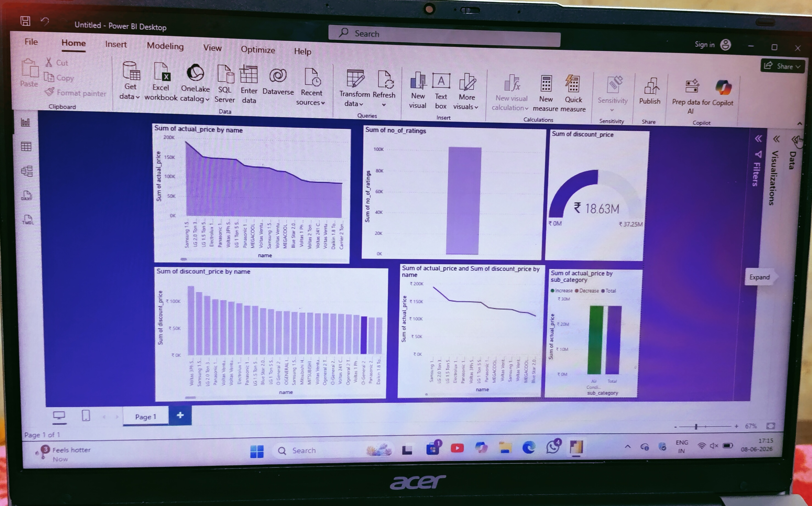

# 🌬️ Air Conditioner Market Analysis — Power BI Dashboard
## 📸 Dashboard Preview



---

## 📌 Project Overview

This project presents an **interactive Power BI dashboard** analyzing the Indian Air Conditioner market. The dashboard provides insights into brand-wise pricing, discount patterns, and customer ratings — helping identify market trends and consumer behavior across major AC brands.

---

## 🎯 Objectives

- Compare actual prices across top AC brands
- Analyze discount patterns and total market discount value
- Understand customer ratings by brand
- Visualize the difference between actual price and discounted price
- Break down performance by AC sub-category

---

## 📊 Dashboard Visuals

| Visual | Description |
|--------|-------------|
| 📈 **Actual Price by Brand** | Area chart comparing sum of actual prices across all major brands |
| ⭐ **Ratings by Brand** | Bar chart showing total number of customer ratings per brand |
| 💰 **Total Discount Gauge** | Gauge chart showing total discount value — ₹18.63M out of ₹37.25M |
| 🔽 **Discount Price by Brand** | Bar chart showing brand-wise discount price comparison |
| 📉 **Actual vs Discount Price** | Line chart comparing actual and discounted prices across brands |
| 🌊 **Price by Sub-Category** | Waterfall chart showing Increase / Decrease / Total by AC sub-category |

---

## 🔍 Key Insights

- 💸 Total discount in the market is **₹18.63M**, which is approximately **50%** of the total actual price (₹37.25M)
- 🏆 **Samsung, LG, and Voltas** are the top premium-priced brands in the AC market
- ⭐ One brand dominates significantly in terms of **customer ratings volume**
- 🌡️ The **Air Conditioner sub-category** shows a clear split between increased and decreased pricing segments
- 📉 There is a **consistent downward trend** in actual prices as we move from premium to budget brands

---

## 🗂️ Dataset Details

| Field | Description |
|-------|-------------|
| `name` | Brand/Product Name |
| `actual_price` | Original price of the AC |
| `discount_price` | Discounted selling price |
| `no_of_ratings` | Number of customer ratings |
| `sub_category` | Category type (Air Conditioner, etc.) |

> 📦 Dataset Source: Amazon India AC product listings

---

## 🛠️ Tools & Technologies Used

| Tool | Purpose |
|------|---------|
| **Power BI Desktop** | Dashboard creation and visualization |
| **Microsoft Excel / CSV** | Data preparation and cleaning |
| **DAX (Data Analysis Expressions)** | Calculated measures and aggregations |

---

## 📁 Project Structure

```
AC-Market-Analysis-PowerBI/
├── AC_Dashboard.pbix          ← Main Power BI file
├── dataset.csv                ← Raw dataset
├── README.md                  ← Project documentation
└── screenshots/
    └── dashboard_overview.png ← Dashboard screenshot
```

---

## 🚀 How to View This Project

1. Download and install [Power BI Desktop](https://powerbi.microsoft.com/desktop/) (free)
2. Clone or download this repository
3. Open `AC_Dashboard.pbix` in Power BI Desktop
4. Explore the interactive visuals and filters

---

## 👩‍💻 About Me

**Iniya**
B.Sc. Computer Science with Data Science
Dhanalakshmi Srinivasan Arts and Science College (Affiliated to Madras University)

🔗 GitHub: [github.com/iniya-26](https://github.com/iniya-26)

---

## 📄 License

This project was developed as part of an internship program. Feel free to explore and learn from it!

---

*Made with 💜 using Power BI*
